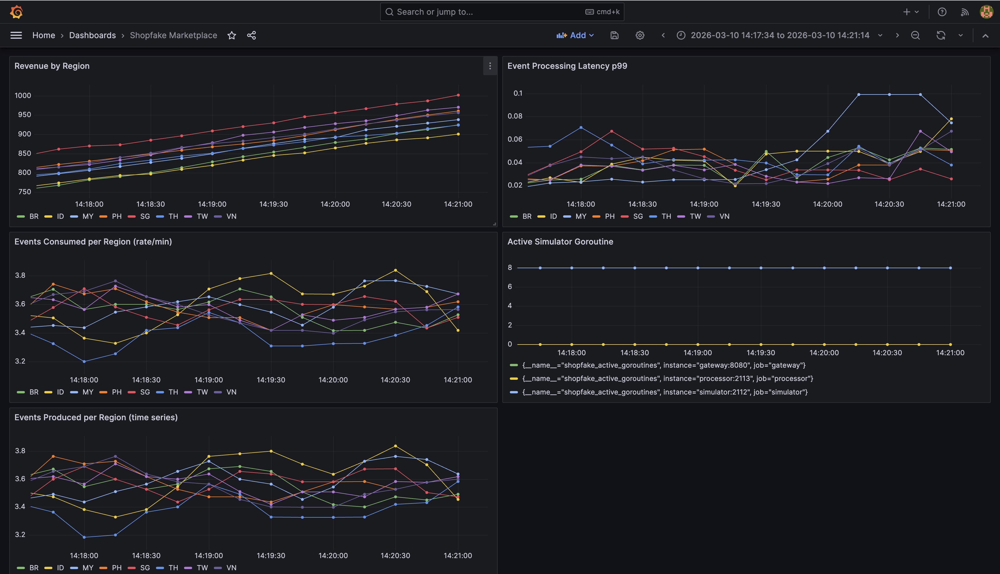

# shopfake-monitoring-sim

Just a simple simulation of a large-scale e-commerce real-time monitoring system with Go, gRPC, Kafka, PostgreSQL, Prometheus, and Grafana, to demonstrate my previous job.


Shopfake Monitoring Sim: E-commerce event monitoring system simulating multi-region marketplace traffic with real-time observability.

Generates synthetic order, payment, and user events across 8 regions (ID, SG, MY, TH, VN, PH, TW, BR), processes them through Kafka, stores in PostgreSQL, and exposes metrics via Prometheus and Grafana dashboards.

## Sample Grafana Dashboard



## Architecture
```
┌──────────────┐     ┌───────┐     ┌──────────────┐       ┌────────────┐
│  Simulator   │────▶│ Kafka │────▶│  Processor   │──────▶│ PostgreSQL │
│  (Go)        │     │       │     │  (Go)        │       │            │
│  8 goroutines│     │       │     │  gRPC server │       │            │
└──────┬───────┘     └───────┘     └───────┬──────┘       └────────────┘
       │                                   | 
       │ /metrics                          │ /metrics
       ▼                                   ▼
┌──────────────┐                   ┌──────────────┐
│  Prometheus  │◀──────────────────│   Gateway    │
│              │                   │   (Go)       │
└──────┬───────┘                   │  REST ─▶ gRPC│
       │                           └──────┬───────┘
       ▼                                  │ /metrics
┌──────────────┐                          │
│   Grafana    │◀─────────────────────────┘
└──────────────┘
```

## Services

**event-simulator** - Spawns one goroutine per region generating weighted random e-commerce events (orders, payments, signups, vouchers) and publishes to Kafka. Messages keyed by region for partition-level ordering.

**event-processor** - Kafka consumer group that processes events and writes to PostgreSQL with idempotent upserts. Exposes a gRPC API for querying aggregated stats (region breakdown, event counts). Runs auto-migration on startup.

**api-gateway** - REST API that proxies requests to the processor via gRPC. Health endpoint for liveness checks. All three services instrumented with Prometheus metrics.

## Tech Stack

Go, gRPC/Protobuf, Kafka, PostgreSQL, Prometheus, Grafana, Docker

## Running
```bash
docker compose up --build
```

| Service    | URL                    |
|------------|------------------------|
| Gateway    | http://localhost:8080   |
| Prometheus | http://localhost:9090   |
| Grafana    | http://localhost:3000   |

Grafana login: admin / admin. Add Prometheus data source with URL `http://prometheus:9090`.

### API
```
GET /health              — health check
GET /api/stats/regions   — order counts, failure rates, revenue by region
GET /api/stats/events    - event counts by type
GET /metrics             — prometheus metrics
```

### Useful Prometheus Queries
```
sum(rate(shopfake_events_produced_total[1m])) by (region)
histogram_quantile(0.99, sum(rate(shopfake_event_processing_duration_seconds_bucket[1m])) by (le, region))
sum(shopfake_order_revenue_total) by (region)
```